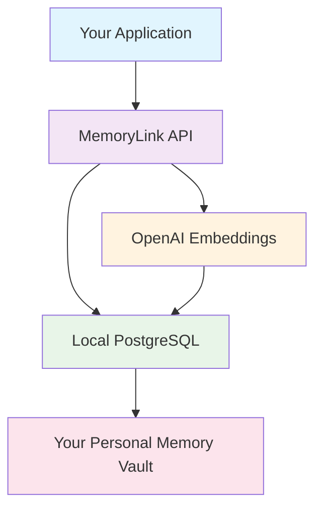

# 🏰 MemoryLink: The Memory Vault Quest

> *"In a world where information flows like rivers, only the Memory Keepers hold the power to capture, organize, and retrieve the essence of knowledge itself."*

Welcome to **MemoryLink** - not just another database, but your personal **Memory Vault** powered by AI. Transform into a Memory Keeper and embark on an epic quest to master the ultimate personal knowledge management system.

## 🎮 Quest Overview: Become a Memory Keeper

```
███╗   ███╗███████╗███╗   ███╗ ██████╗ ██████╗ ██╗   ██╗██╗     ██╗███╗   ██╗██╗  ██╗
████╗ ████║██╔════╝████╗ ████║██╔═══██╗██╔══██╗╚██╗ ██╔╝██║     ██║████╗  ██║██║ ██╔╝
██╔████╔██║█████╗  ██╔████╔██║██║   ██║██████╔╝ ╚████╔╝ ██║     ██║██╔██╗ ██║█████╔╝ 
██║╚██╔╝██║██╔══╝  ██║╚██╔╝██║██║   ██║██╔══██╗  ╚██╔╝  ██║     ██║██║╚██╗██║██╔═██╗ 
██║ ╚═╝ ██║███████╗██║ ╚═╝ ██║╚██████╔╝██║  ██║   ██║   ███████╗██║██║ ╚████║██║  ██╗
╚═╝     ╚═╝╚══════╝╚═╝     ╚═╝ ╚═════╝ ╚═╝  ╚═╝   ╚═╝   ╚══════╝╚═╝╚═╝  ╚═══╝╚═╝  ╚═╝
```

### ⚡ Quick Start (The Impatient Adventurer's Path)

```bash
# 🚀 Summon the Memory Vault
make start

# 💾 Add your first memories  
make add_sample

# 🔍 Search with AI power
make search

# 🎯 Complete the full quest
make tutorial
```

## 🎯 The Memory Keeper's Journey

| Level | Quest Stage | Achievement | Unlock |
|-------|------------|-------------|---------|
| 🥚 **Level 1** | Vault Summoner | Awaken the server | `make start` |
| 🌱 **Level 2** | Memory Scribe | Record first memories | `make add_sample` |
| ⚡ **Level 3** | Vault Explorer | Master semantic search | `make search` |
| 🔮 **Level 4** | Integration Master | API mastery | Tutorial complete |
| 👑 **Level 5+** | Memory Keeper | Build amazing apps | Unlimited power! |

## 🎪 Why MemoryLink is Different

Traditional databases are like filing cabinets - you need to remember exactly where you put things. **MemoryLink is like having a genius librarian** who understands the *meaning* behind your memories.

### 🧠 The Magic Behind the Vault

- **🤖 AI-Powered Semantic Search**: Find memories by meaning, not just keywords
- **🏗️ Local-First Architecture**: Your memories stay on your machine
- **⚡ Lightning Fast**: Vector embeddings + PostgreSQL = instant results
- **🎨 Beautiful Developer Experience**: Gamified CLI that makes setup fun
- **🔧 Easy Integration**: RESTful API ready for any application

### 🌟 What Makes Memory Keepers Smile

```python
# Instead of: "What was that Python thing about decorators I read last week?"
# You can: "Show me content about Python decorators from recent readings"

memories = memory_vault.search("Python decorators explanation", limit=5)
# 🎯 Finds your decorator notes even if you called them "function wrappers"
```

## 🚀 Installation & Setup

### Prerequisites (Gathering Your Tools)

- **Docker & Docker Compose** (The vault infrastructure)
- **Python 3.8+** (Your quest companion)
- **Make** (The spell-casting utility)

### 🏗️ One-Command Setup

```bash
# Clone the Memory Vault
git clone https://github.com/your-username/MemoryLink.git
cd MemoryLink

# Begin your quest!
make tutorial
```

## 🎮 The Memory Vault Quest Commands

### 📚 Quest Progression
```bash
make tutorial        # 🎯 Start the guided Memory Keeper quest
make status          # 📊 Check your progress and achievements  
make help            # 📖 View all available commands
```

### ⚡ Core Vault Operations
```bash
make start           # 🚀 Awaken the Memory Vault server
make stop            # ⏹️ Seal the vault safely
make add_sample      # 💾 Add sample memories (with achievements!)
make search          # 🔍 Interactive AI-powered search
make test            # 🧪 Run quality assurance spells
```

### 🎉 Easter Eggs & Fun
```bash
make dance           # 💃 Make MemoryLink dance
make credits         # 👥 View quest credits and achievements
```

## 🛡️ Architecture: The Vault's Inner Workings

```
┌─────────────────────────────────────────────────────┐
│                 Memory Vault                        │
├─────────────────────────────────────────────────────┤
│  🎯 FastAPI Server (The Gatekeeper)                │
│  ├── 🔍 Semantic Search Engine                     │
│  ├── 💾 Memory Storage Layer                       │  
│  └── 🤖 OpenAI Embeddings                          │
├─────────────────────────────────────────────────────┤
│  🐘 PostgreSQL + pgvector (The Vault)              │
│  ├── 📚 Document Storage                           │
│  ├── 🧠 Vector Embeddings                          │
│  └── ⚡ Lightning-Fast Retrieval                   │
└─────────────────────────────────────────────────────┘
```

### 🎨 The Local-First Philosophy



## 🔧 API Reference: Your Developer Toolkit

### 🌟 Core Endpoints

```python
# 🚀 Health Check
GET /health

# 💾 Store a Memory
POST /memories/
{
  "content": "Your memory content here",
  "metadata": {"source": "web", "tags": ["important"]}
}

# 🔍 Semantic Search  
POST /search/
{
  "query": "search for meaning, not just words",
  "limit": 10,
  "threshold": 0.7
}

# 📚 Retrieve All Memories
GET /memories/
```

### 🎯 Python Integration Example

```python
import requests

class MemoryVault:
    def __init__(self, base_url="http://localhost:8000"):
        self.base_url = base_url
    
    def store_memory(self, content, metadata=None):
        """Store a new memory in the vault"""
        response = requests.post(f"{self.base_url}/memories/", json={
            "content": content,
            "metadata": metadata or {}
        })
        return response.json()
    
    def search_memories(self, query, limit=10):
        """Search memories by meaning"""
        response = requests.post(f"{self.base_url}/search/", json={
            "query": query,
            "limit": limit
        })
        return response.json()

# 🎮 Use the vault
vault = MemoryVault()

# Store your first memory
vault.store_memory(
    "Python decorators are functions that modify other functions",
    metadata={"topic": "python", "difficulty": "intermediate"}
)

# Find it later with semantic search
memories = vault.search_memories("function modifiers in Python")
```

## 🎯 Achievement System

Unlock achievements as you master the Memory Vault:

| 🏆 Achievement | Description | Unlock Condition |
|----------------|-------------|------------------|
| **Vault Keeper** | Server summoning master | First successful startup |
| **Memory Scribe** | First memories recorded | Add sample data |
| **Vault Explorer** | Semantic search adept | Complete first search |
| **Quality Guardian** | Testing sentinel | Run test suite |
| **Integration Master** | API mastery achieved | Complete tutorial |
| **Groove Master** | Found the dance easter egg | `make dance` |

## 📚 Advanced Usage

### 🔮 Custom Integrations

```javascript
// 🌐 JavaScript/Node.js Example
const MemoryLink = {
  async store(content, metadata = {}) {
    const response = await fetch('http://localhost:8000/memories/', {
      method: 'POST',
      headers: { 'Content-Type': 'application/json' },
      body: JSON.stringify({ content, metadata })
    });
    return response.json();
  },

  async search(query, limit = 10) {
    const response = await fetch('http://localhost:8000/search/', {
      method: 'POST', 
      headers: { 'Content-Type': 'application/json' },
      body: JSON.stringify({ query, limit })
    });
    return response.json();
  }
};

// 💫 Store and search memories
await MemoryLink.store("React hooks revolutionized state management", {
  framework: "react",
  concept: "hooks"
});

const memories = await MemoryLink.search("React state management techniques");
```

### 🛠️ Configuration & Environment

```bash
# Environment Variables (create .env file)
OPENAI_API_KEY=your_openai_key_here
POSTGRES_USER=memorykeeper  
POSTGRES_PASSWORD=vault_secret
POSTGRES_DB=memory_vault
```

### 🔍 Advanced Search Features

```python
# 🎯 Search with similarity threshold
memories = vault.search_memories(
    query="machine learning algorithms",
    limit=20,
    threshold=0.8  # Higher threshold = more strict matches
)

# 🏷️ Filter by metadata
memories = vault.search_memories(
    query="Python tutorials", 
    metadata_filter={"difficulty": "beginner"}
)
```

## 🚨 Troubleshooting Guide

### Common Quest Obstacles

**🔥 Server won't start?**
```bash
# Check if ports are available
docker-compose down
make cleanup
make start
```

**🤖 OpenAI API issues?**
```bash
# Verify API key
echo $OPENAI_API_KEY
# Set if missing:
export OPENAI_API_KEY="your-key-here"
```

**🐘 Database connection problems?**
```bash
# Reset the vault completely
make cleanup  # ⚠️ This destroys all data!
make start
```

## 🌟 Contributing to the Quest

Join the Memory Keeper community! 

1. **🍴 Fork** the repository
2. **🌿 Create** a feature branch (`git checkout -b feature/amazing-feature`)
3. **💾 Commit** your changes (`git commit -m 'Add amazing feature'`)
4. **🚀 Push** to the branch (`git push origin feature/amazing-feature`)
5. **🎯 Open** a Pull Request

### 🎨 Development Setup

```bash
# Set up development environment
python -m venv venv
source venv/bin/activate  # On Windows: venv\Scripts\activate
pip install -r requirements-dev.txt

# Run in development mode
python src/main.py --reload
```

## 📄 License & Credits

**License**: MIT - Build amazing things with MemoryLink!

### 🙏 Quest Acknowledgments

- **🧠 OpenAI**: For making semantic search magical
- **🐘 PostgreSQL + pgvector**: The solid foundation of our vault
- **⚡ FastAPI**: Lightning-fast API framework
- **🎮 The Gaming Community**: Inspiration for gamified developer experiences
- **💖 You**: For believing in better developer tools

## 🔗 Useful Links

- **📖 Full Documentation**: [`docs/`](./docs/)
- **🎯 API Reference**: [`docs/api.md`](./docs/api.md)
- **🛠️ Developer Guide**: [`docs/development.md`](./docs/development.md)
- **❓ FAQ**: [`docs/faq.md`](./docs/faq.md)

---

## 🎊 Ready to Begin Your Quest?

```bash
make tutorial
```

*Transform into a Memory Keeper and unlock the power of AI-enhanced personal knowledge management. Your memories are waiting to be organized, searched, and connected in ways you never imagined possible.*

**Welcome to the Memory Vault. Your quest begins now.**

---

<div align="center">

*Built with ❤️ by developers, for developers*

🎮 **Game on!** | 💾 **Memory up!** | 🚀 **Level up!**

</div>