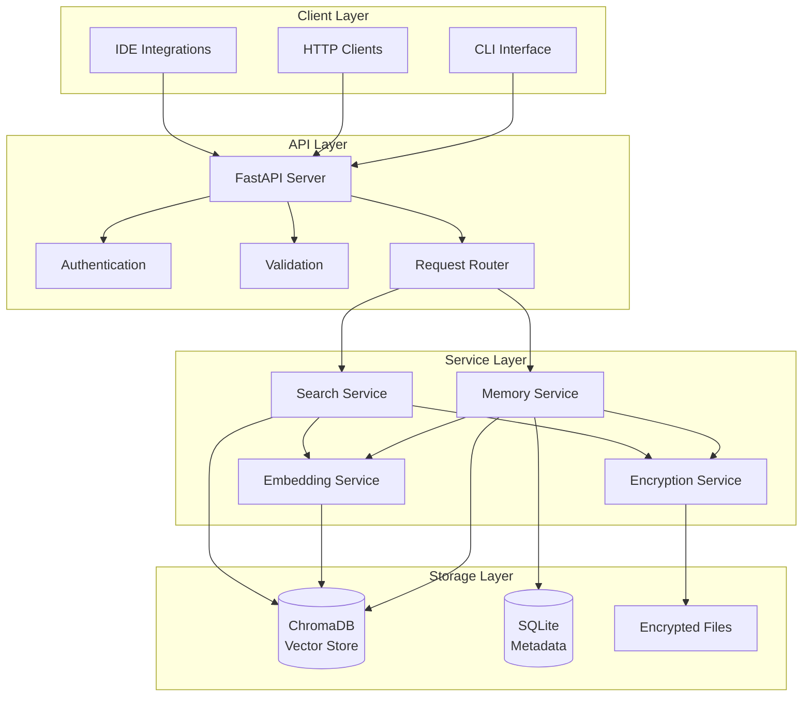

# MemoryLink Technical Documentation
*Comprehensive Technical Guide for Developers and System Administrators*

## 🏗️ Architecture Overview

MemoryLink is built on a **local-first architecture** that prioritizes privacy, performance, and scalability. The system uses a microservices-inspired design while maintaining simplicity for single-node deployments.

### System Components



### Technology Stack

| Component | Technology | Version | Purpose |
|-----------|------------|---------|----------|
| **API Framework** | FastAPI | 0.104+ | HTTP API server with async support |
| **Runtime** | Python | 3.11+ | Application runtime environment |
| **ASGI Server** | Uvicorn | 0.24+ | Production ASGI server |
| **Vector Database** | ChromaDB | 0.4+ | Semantic search and vector storage |
| **Embeddings** | SentenceTransformers | 2.2+ | Local text embeddings generation |
| **Encryption** | PyCryptodome | 3.19+ | AES-256-GCM encryption |
| **Database** | SQLite | 3.40+ | Metadata and configuration storage |
| **Containerization** | Docker | 24+ | Container deployment platform |
| **Orchestration** | Kubernetes | 1.28+ | Production container orchestration |

## 🔧 Detailed Component Architecture

### FastAPI Application Structure

```python
# Application Bootstrap
@asynccontextmanager
async def lifespan(app: FastAPI):
    """Application lifecycle management."""
    # Startup
    logger.info("MemoryLink backend starting up...")
    
    # Initialize services
    await initialize_embedding_service()
    await initialize_vector_store()
    await validate_encryption_setup()
    
    yield
    
    # Shutdown
    logger.info("MemoryLink backend shutting down...")
    await cleanup_services()

app = FastAPI(
    title="MemoryLink Backend API",
    description="Local-first personal memory system",
    version="1.0.0",
    lifespan=lifespan
)
```

### Memory Service Implementation

```python
class MemoryService:
    """Core memory management service."""
    
    def __init__(self):
        self.vector_store = ChromaVectorStore()
        self.encryption = EncryptionService()
        self.embedding = EmbeddingService()
        self.metadata_db = SQLiteMetadataStore()
    
    async def store_memory(self, content: str, metadata: dict) -> MemoryResult:
        """Store a new memory with full processing pipeline."""
        # Validate input
        validated_content = self._validate_content(content)
        validated_metadata = self._validate_metadata(metadata)
        
        # Generate unique ID
        memory_id = self._generate_memory_id()
        
        # Encrypt content
        encrypted_content = await self.encryption.encrypt(validated_content)
        
        # Generate embedding
        embedding_vector = await self.embedding.generate(
            text=validated_content,
            cache_key=memory_id
        )
        
        # Store in vector database
        await self.vector_store.insert(
            id=memory_id,
            embedding=embedding_vector,
            metadata={
                **validated_metadata,
                'content_hash': hashlib.sha256(validated_content.encode()).hexdigest(),
                'created_at': datetime.utcnow().isoformat(),
                'content_length': len(validated_content),
                'encrypted': True
            }
        )
        
        # Store encrypted content and metadata
        await self.metadata_db.insert(
            memory_id=memory_id,
            encrypted_content=encrypted_content,
            metadata=validated_metadata,
            created_at=datetime.utcnow()
        )
        
        return MemoryResult(
            id=memory_id,
            status="stored",
            content_preview=validated_content[:100],
            metadata=validated_metadata
        )
    
    async def search_memories(self, query: str, limit: int = 10, 
                            threshold: float = 0.3) -> List[SearchResult]:
        """Search memories using semantic similarity."""
        # Generate query embedding
        query_embedding = await self.embedding.generate(
            text=query,
            cache_key=f"query:{hashlib.md5(query.encode()).hexdigest()}"
        )
        
        # Search vector store
        vector_results = await self.vector_store.search(
            query_embedding=query_embedding,
            limit=limit * 2,  # Over-fetch for filtering
            threshold=threshold
        )
        
        # Retrieve and decrypt content
        search_results = []
        for vector_result in vector_results[:limit]:
            # Get encrypted content
            metadata_record = await self.metadata_db.get(vector_result.id)
            
            # Decrypt content
            decrypted_content = await self.encryption.decrypt(
                metadata_record.encrypted_content
            )
            
            search_results.append(SearchResult(
                memory_id=vector_result.id,
                content=decrypted_content,
                similarity=vector_result.similarity,
                metadata=vector_result.metadata,
                created_at=metadata_record.created_at
            ))
        
        return search_results
```

### Vector Store Implementation

```python
class ChromaVectorStore:
    """ChromaDB-based vector storage implementation."""
    
    def __init__(self, collection_name: str = "memories"):
        self.client = chromadb.PersistentClient(
            path=settings.vector_db_path
        )
        self.collection = self.client.get_or_create_collection(
            name=collection_name,
            metadata={"hnsw:space": "cosine"}  # Cosine similarity
        )
    
    async def insert(self, id: str, embedding: List[float], 
                    metadata: Dict[str, Any]) -> None:
        """Insert vector with metadata."""
        # ChromaDB requires string values for metadata
        string_metadata = self._convert_metadata_to_strings(metadata)
        
        self.collection.add(
            ids=[id],
            embeddings=[embedding],
            metadatas=[string_metadata]
        )
    
    async def search(self, query_embedding: List[float], 
                    limit: int, threshold: float) -> List[VectorResult]:
        """Search for similar vectors."""
        results = self.collection.query(
            query_embeddings=[query_embedding],
            n_results=limit,
            include=["metadatas", "distances"]
        )
        
        vector_results = []
        for i, (id, distance, metadata) in enumerate(zip(
            results['ids'][0],
            results['distances'][0], 
            results['metadatas'][0]
        )):
            similarity = 1 - distance  # Convert distance to similarity
            if similarity >= threshold:
                vector_results.append(VectorResult(
                    id=id,
                    similarity=similarity,
                    metadata=self._convert_metadata_from_strings(metadata)
                ))
        
        return vector_results
    
    def _convert_metadata_to_strings(self, metadata: Dict) -> Dict[str, str]:
        """Convert metadata values to strings for ChromaDB."""
        return {
            key: json.dumps(value) if not isinstance(value, str) else value
            for key, value in metadata.items()
        }
    
    def _convert_metadata_from_strings(self, metadata: Dict[str, str]) -> Dict:
        """Convert string metadata back to original types."""
        converted = {}
        for key, value in metadata.items():
            try:
                # Try to parse as JSON first
                converted[key] = json.loads(value)
            except (json.JSONDecodeError, TypeError):
                # Keep as string if not valid JSON
                converted[key] = value
        return converted
```

### Encryption Service

```python
class EncryptionService:
    """AES-256-GCM encryption service for content security."""
    
    def __init__(self):
        self.key = self._derive_key(settings.encryption_key)
        self.algorithm = "AES-256-GCM"
        
    def _derive_key(self, password: str) -> bytes:
        """Derive encryption key from password using PBKDF2."""
        salt = settings.encryption_salt.encode() if settings.encryption_salt else b'memorylink_salt_v1'
        kdf = PBKDF2HMAC(
            algorithm=hashes.SHA256(),
            length=32,
            salt=salt,
            iterations=100000,
        )
        return kdf.derive(password.encode())
    
    async def encrypt(self, plaintext: str) -> EncryptedData:
        """Encrypt plaintext using AES-256-GCM."""
        # Generate random nonce
        nonce = os.urandom(12)  # 96-bit nonce for GCM
        
        # Create cipher
        cipher = Cipher(
            algorithms.AES(self.key),
            modes.GCM(nonce),
            backend=default_backend()
        )
        encryptor = cipher.encryptor()
        
        # Encrypt data
        ciphertext = encryptor.update(plaintext.encode('utf-8'))
        encryptor.finalize()
        
        return EncryptedData(
            ciphertext=ciphertext,
            nonce=nonce,
            tag=encryptor.tag,
            algorithm=self.algorithm
        )
    
    async def decrypt(self, encrypted_data: EncryptedData) -> str:
        """Decrypt ciphertext using AES-256-GCM."""
        # Create cipher with nonce and tag
        cipher = Cipher(
            algorithms.AES(self.key),
            modes.GCM(encrypted_data.nonce, encrypted_data.tag),
            backend=default_backend()
        )
        decryptor = cipher.decryptor()
        
        # Decrypt data
        plaintext_bytes = decryptor.update(encrypted_data.ciphertext)
        decryptor.finalize()
        
        return plaintext_bytes.decode('utf-8')
```

### Embedding Service with Caching

```python
class EmbeddingService:
    """SentenceTransformer-based embedding generation with caching."""
    
    def __init__(self):
        self.model_name = settings.embedding_model
        self.model = None  # Lazy loading
        self.cache = TTLCache(
            maxsize=settings.embedding_cache_size,
            ttl=settings.embedding_cache_ttl
        )
        self._model_lock = asyncio.Lock()
    
    async def _load_model(self):
        """Load embedding model (lazy initialization)."""
        if self.model is None:
            async with self._model_lock:
                if self.model is None:  # Double-check locking
                    logger.info(f"Loading embedding model: {self.model_name}")
                    self.model = SentenceTransformer(self.model_name)
                    logger.info("Embedding model loaded successfully")
    
    async def generate(self, text: str, cache_key: str = None) -> List[float]:
        """Generate embedding vector for text."""
        # Check cache first
        if cache_key and cache_key in self.cache:
            return self.cache[cache_key]
        
        # Load model if needed
        await self._load_model()
        
        # Generate embedding (run in thread pool to avoid blocking)
        loop = asyncio.get_event_loop()
        embedding = await loop.run_in_executor(
            None, 
            self._generate_embedding, 
            text
        )
        
        # Cache result
        if cache_key:
            self.cache[cache_key] = embedding
        
        return embedding
    
    def _generate_embedding(self, text: str) -> List[float]:
        """Synchronous embedding generation."""
        # Normalize text
        normalized_text = self._normalize_text(text)
        
        # Generate embedding
        embedding = self.model.encode(
            normalized_text,
            convert_to_numpy=True,
            normalize_embeddings=True
        )
        
        return embedding.tolist()
    
    def _normalize_text(self, text: str) -> str:
        """Normalize text for consistent embeddings."""
        # Remove excessive whitespace
        text = ' '.join(text.split())
        
        # Limit length to model's maximum
        max_length = 512  # BERT-like models typically handle 512 tokens
        if len(text.split()) > max_length:
            text = ' '.join(text.split()[:max_length])
        
        return text
```

## 🐳 Container Architecture

### Multi-Stage Dockerfile

```dockerfile
# Multi-stage build for production optimization
FROM python:3.11-slim as builder

# Install build dependencies
RUN apt-get update && apt-get install -y \
    gcc \
    g++ \
    python3-dev \
    && rm -rf /var/lib/apt/lists/*

# Copy requirements and install Python dependencies
COPY requirements/prod.txt /tmp/requirements.txt
RUN pip wheel --no-cache-dir --no-deps --wheel-dir /tmp/wheels \
    -r /tmp/requirements.txt

# Production stage
FROM python:3.11-slim as production

# Create non-root user for security
RUN groupadd --gid 1000 memorylink && \
    useradd --uid 1000 --gid memorylink --shell /bin/bash --create-home memorylink

# Install runtime dependencies
RUN apt-get update && apt-get install -y \
    curl \
    sqlite3 \
    && rm -rf /var/lib/apt/lists/*

# Install Python dependencies from wheels
COPY --from=builder /tmp/wheels /tmp/wheels
COPY requirements/prod.txt /tmp/requirements.txt
RUN pip install --no-cache-dir --no-index --find-links /tmp/wheels \
    -r /tmp/requirements.txt && \
    rm -rf /tmp/wheels /tmp/requirements.txt

# Create application directories
RUN mkdir -p /app /data/{vector,metadata,logs,backups} && \
    chown -R memorylink:memorylink /app /data

# Copy application code
COPY --chown=memorylink:memorylink backend/src/ /app/src/
COPY --chown=memorylink:memorylink backend/run.py /app/
COPY --chown=memorylink:memorylink docker/entrypoint.sh /app/

# Make entrypoint executable
RUN chmod +x /app/entrypoint.sh

# Set working directory and user
WORKDIR /app
USER memorylink

# Health check
HEALTHCHECK --interval=30s --timeout=10s --start-period=30s --retries=3 \
    CMD curl -f http://localhost:${API_PORT:-8080}/health || exit 1

# Expose port
EXPOSE 8080

# Set entrypoint
ENTRYPOINT ["/app/entrypoint.sh"]
CMD ["python", "run.py"]
```

### Container Entrypoint

```bash
#!/bin/bash
# docker/entrypoint.sh - Production container entrypoint

set -e

# Logging function
log() {
    echo "[$(date +'%Y-%m-%d %H:%M:%S')] MemoryLink: $1" >&2
}

# Environment validation
validate_environment() {
    log "Validating environment configuration..."
    
    # Check required environment variables
    if [ -z "$ENCRYPTION_KEY" ]; then
        log "ERROR: ENCRYPTION_KEY environment variable is required"
        exit 1
    fi
    
    # Validate encryption key length (32 bytes = 256 bits)
    if [ ${#ENCRYPTION_KEY} -lt 32 ]; then
        log "WARNING: ENCRYPTION_KEY should be at least 32 characters for security"
    fi
    
    # Set defaults
    export API_HOST=${API_HOST:-"0.0.0.0"}
    export API_PORT=${API_PORT:-8080}
    export LOG_LEVEL=${LOG_LEVEL:-"INFO"}
    export DATA_PATH=${DATA_PATH:-"/data"}
    
    log "Environment validation completed"
}

# Data directory initialization
init_data_directories() {
    log "Initializing data directories..."
    
    # Create data directories if they don't exist
    mkdir -p "${DATA_PATH}/{vector,metadata,logs,backups}"
    
    # Set permissions
    chmod 755 "${DATA_PATH}"
    chmod 700 "${DATA_PATH}/metadata"  # Sensitive data
    
    log "Data directories initialized"
}

# Health check setup
setup_health_checks() {
    log "Setting up health monitoring..."
    
    # Create health check endpoint test
    cat > /tmp/health_check.sh << 'EOF'
#!/bin/bash
response=$(curl -s -o /dev/null -w "%{http_code}" http://localhost:${API_PORT}/health)
if [ "$response" = "200" ]; then
    exit 0
else
    exit 1
fi
EOF
    
    chmod +x /tmp/health_check.sh
    log "Health monitoring configured"
}

# Signal handlers for graceful shutdown
handler_term() {
    log "Received SIGTERM, initiating graceful shutdown..."
    kill -TERM "$child_pid" 2>/dev/null
    wait "$child_pid"
    exit 0
}

handler_int() {
    log "Received SIGINT, initiating graceful shutdown..."
    kill -INT "$child_pid" 2>/dev/null
    wait "$child_pid"
    exit 0
}

# Set up signal handlers
trap handler_term TERM
trap handler_int INT

# Main initialization
main() {
    log "MemoryLink container starting..."
    
    validate_environment
    init_data_directories
    setup_health_checks
    
    log "Starting MemoryLink application..."
    log "API will be available at http://${API_HOST}:${API_PORT}"
    
    # Start the application in background
    "$@" &
    child_pid=$!
    
    # Wait for application to start
    sleep 5
    
    # Verify application started successfully
    if ! /tmp/health_check.sh; then
        log "ERROR: Application failed to start or health check failed"
        kill -TERM "$child_pid" 2>/dev/null
        exit 1
    fi
    
    log "MemoryLink application started successfully (PID: $child_pid)"
    
    # Wait for child process
    wait "$child_pid"
    exit_code=$?
    
    log "MemoryLink application exited with code: $exit_code"
    exit $exit_code
}

# Run main function with all arguments
main "$@"
```

## ☸️ Kubernetes Deployment

### Base Deployment Manifest

```yaml
# k8s/base/deployment.yaml
apiVersion: apps/v1
kind: Deployment
metadata:
  name: memorylink-deployment
  namespace: memorylink
  labels:
    app: memorylink
    component: api
spec:
  replicas: 2
  selector:
    matchLabels:
      app: memorylink
      component: api
  template:
    metadata:
      labels:
        app: memorylink
        component: api
    spec:
      serviceAccountName: memorylink-sa
      securityContext:
        runAsNonRoot: true
        runAsUser: 1000
        runAsGroup: 1000
        fsGroup: 1000
      containers:
      - name: memorylink
        image: memorylink:latest
        imagePullPolicy: Always
        ports:
        - containerPort: 8080
          name: http
          protocol: TCP
        env:
        - name: API_HOST
          value: "0.0.0.0"
        - name: API_PORT
          value: "8080"
        - name: LOG_LEVEL
          value: "INFO"
        - name: DATA_PATH
          value: "/data"
        envFrom:
        - configMapRef:
            name: memorylink-config
        - secretRef:
            name: memorylink-secrets
        resources:
          requests:
            memory: "256Mi"
            cpu: "100m"
          limits:
            memory: "1Gi"
            cpu: "500m"
        volumeMounts:
        - name: data-volume
          mountPath: /data
        - name: tmp-volume
          mountPath: /tmp
        livenessProbe:
          httpGet:
            path: /health
            port: http
          initialDelaySeconds: 30
          periodSeconds: 30
          timeoutSeconds: 10
          failureThreshold: 3
        readinessProbe:
          httpGet:
            path: /health
            port: http
          initialDelaySeconds: 5
          periodSeconds: 10
          timeoutSeconds: 5
          failureThreshold: 2
        securityContext:
          allowPrivilegeEscalation: false
          readOnlyRootFilesystem: true
          capabilities:
            drop:
            - ALL
      volumes:
      - name: data-volume
        persistentVolumeClaim:
          claimName: memorylink-pvc
      - name: tmp-volume
        emptyDir:
          sizeLimit: "100Mi"
```

### Production Scaling Configuration

```yaml
# k8s/overlays/production/hpa.yaml
apiVersion: autoscaling/v2
kind: HorizontalPodAutoscaler
metadata:
  name: memorylink-hpa
  namespace: memorylink
spec:
  scaleTargetRef:
    apiVersion: apps/v1
    kind: Deployment
    name: memorylink-deployment
  minReplicas: 2
  maxReplicas: 10
  metrics:
  - type: Resource
    resource:
      name: cpu
      target:
        type: Utilization
        averageUtilization: 70
  - type: Resource
    resource:
      name: memory
      target:
        type: Utilization
        averageUtilization: 80
  behavior:
    scaleUp:
      stabilizationWindowSeconds: 300
      policies:
      - type: Percent
        value: 50
        periodSeconds: 60
    scaleDown:
      stabilizationWindowSeconds: 300
      policies:
      - type: Percent
        value: 25
        periodSeconds: 60

---
apiVersion: policy/v1
kind: PodDisruptionBudget
metadata:
  name: memorylink-pdb
  namespace: memorylink
spec:
  minAvailable: 1
  selector:
    matchLabels:
      app: memorylink
      component: api
```

### Security Policies

```yaml
# k8s/overlays/production/network-policy.yaml
apiVersion: networking.k8s.io/v1
kind: NetworkPolicy
metadata:
  name: memorylink-network-policy
  namespace: memorylink
spec:
  podSelector:
    matchLabels:
      app: memorylink
  policyTypes:
  - Ingress
  - Egress
  ingress:
  - from:
    - namespaceSelector:
        matchLabels:
          name: ingress-nginx
    - podSelector:
        matchLabels:
          app: memorylink-client
    ports:
    - protocol: TCP
      port: 8080
  egress:
  # Allow DNS resolution
  - to: []
    ports:
    - protocol: UDP
      port: 53
  # Allow HTTPS for model downloads (startup only)
  - to: []
    ports:
    - protocol: TCP
      port: 443
  # Allow internal communication
  - to:
    - podSelector:
        matchLabels:
          app: memorylink
```

## 🔐 Security Implementation

### Encryption at Rest

```python
# Advanced encryption configuration
class SecurityConfig:
    """Security configuration and key management."""
    
    def __init__(self):
        self.encryption_key = self._load_encryption_key()
        self.salt = self._generate_or_load_salt()
        self.key_rotation_interval = timedelta(days=90)
        self.last_rotation = self._get_last_rotation_date()
    
    def _load_encryption_key(self) -> bytes:
        """Load encryption key from environment or file."""
        # Try environment variable first
        key_env = os.getenv('ENCRYPTION_KEY')
        if key_env:
            return self._derive_key_from_password(key_env)
        
        # Try key file
        key_file = os.getenv('ENCRYPTION_KEY_FILE', '/secrets/encryption.key')
        if os.path.exists(key_file):
            with open(key_file, 'rb') as f:
                return f.read()
        
        # Generate new key (development only)
        if os.getenv('ENVIRONMENT') == 'development':
            logger.warning("Generating new encryption key for development")
            return os.urandom(32)
        
        raise ValueError("No encryption key found. Set ENCRYPTION_KEY or ENCRYPTION_KEY_FILE")
    
    def _derive_key_from_password(self, password: str) -> bytes:
        """Derive encryption key from password using PBKDF2."""
        kdf = PBKDF2HMAC(
            algorithm=hashes.SHA256(),
            length=32,
            salt=self.salt,
            iterations=100000,
        )
        return kdf.derive(password.encode())
    
    def should_rotate_key(self) -> bool:
        """Check if key rotation is needed."""
        if not self.last_rotation:
            return True
        return datetime.now() - self.last_rotation > self.key_rotation_interval
```

### Input Validation and Sanitization

```python
from pydantic import BaseModel, Field, validator
from typing import Optional, Dict, List, Any

class MemoryCreateRequest(BaseModel):
    """Memory creation request with validation."""
    
    content: str = Field(
        ...,
        min_length=1,
        max_length=50000,
        description="Memory content (1-50,000 characters)"
    )
    metadata: Optional[Dict[str, Any]] = Field(
        default_factory=dict,
        description="Optional metadata dictionary"
    )
    
    @validator('content')
    def validate_content(cls, v):
        # Remove potentially harmful content
        v = v.strip()
        
        # Basic HTML/script injection prevention
        dangerous_patterns = [
            r'<script[^>]*>.*?</script>',
            r'javascript:',
            r'vbscript:',
            r'onload=',
            r'onerror='
        ]
        
        for pattern in dangerous_patterns:
            if re.search(pattern, v, re.IGNORECASE):
                raise ValueError(f"Content contains potentially harmful patterns")
        
        return v
    
    @validator('metadata')
    def validate_metadata(cls, v):
        if not isinstance(v, dict):
            raise ValueError("Metadata must be a dictionary")
        
        # Limit metadata size
        if len(json.dumps(v)) > 10000:  # 10KB limit
            raise ValueError("Metadata too large (max 10KB)")
        
        # Sanitize string values
        sanitized = {}
        for key, value in v.items():
            # Validate key
            if not isinstance(key, str) or len(key) > 100:
                raise ValueError(f"Invalid metadata key: {key}")
            
            # Sanitize value
            if isinstance(value, str):
                sanitized[key] = html.escape(value)
            elif isinstance(value, (int, float, bool)):
                sanitized[key] = value
            elif isinstance(value, list):
                sanitized[key] = [html.escape(str(item)) for item in value]
            else:
                sanitized[key] = html.escape(str(value))
        
        return sanitized

class SearchRequest(BaseModel):
    """Search request with validation."""
    
    query: str = Field(
        ...,
        min_length=1,
        max_length=1000,
        description="Search query (1-1,000 characters)"
    )
    limit: int = Field(
        default=10,
        ge=1,
        le=100,
        description="Maximum number of results (1-100)"
    )
    threshold: float = Field(
        default=0.3,
        ge=0.0,
        le=1.0,
        description="Similarity threshold (0.0-1.0)"
    )
    
    @validator('query')
    def validate_query(cls, v):
        # Basic query sanitization
        v = v.strip()
        
        # Remove excessive whitespace
        v = ' '.join(v.split())
        
        return v
```

### Audit Logging

```python
import structlog
from datetime import datetime
from typing import Optional, Dict, Any

class AuditLogger:
    """Security audit logging for MemoryLink operations."""
    
    def __init__(self):
        self.logger = structlog.get_logger("audit")
    
    def log_memory_operation(self, operation: str, memory_id: str, 
                           user_id: Optional[str] = None, 
                           client_ip: Optional[str] = None,
                           metadata: Optional[Dict] = None):
        """Log memory-related operations."""
        self.logger.info(
            "memory_operation",
            operation=operation,
            memory_id=memory_id,
            user_id=user_id or "anonymous",
            client_ip=client_ip or "unknown",
            timestamp=datetime.utcnow().isoformat(),
            metadata=metadata or {},
            # Never log sensitive content
            content_logged=False
        )
    
    def log_search_operation(self, query_hash: str, results_count: int,
                           search_time_ms: float, user_id: Optional[str] = None,
                           client_ip: Optional[str] = None):
        """Log search operations (query content is hashed for privacy)."""
        self.logger.info(
            "search_operation",
            query_hash=query_hash,
            results_count=results_count,
            search_time_ms=search_time_ms,
            user_id=user_id or "anonymous",
            client_ip=client_ip or "unknown",
            timestamp=datetime.utcnow().isoformat()
        )
    
    def log_security_event(self, event_type: str, severity: str, 
                          details: Dict[str, Any], user_id: Optional[str] = None,
                          client_ip: Optional[str] = None):
        """Log security-related events."""
        self.logger.warning(
            "security_event",
            event_type=event_type,
            severity=severity,
            details=details,
            user_id=user_id or "anonymous",
            client_ip=client_ip or "unknown",
            timestamp=datetime.utcnow().isoformat()
        )
```

## 📊 Monitoring and Observability

### Metrics Collection

```python
from prometheus_client import Counter, Histogram, Gauge, generate_latest
import time
from functools import wraps

# Metrics definitions
memory_operations_total = Counter(
    'memorylink_memory_operations_total',
    'Total number of memory operations',
    ['operation', 'status']
)

search_duration_seconds = Histogram(
    'memorylink_search_duration_seconds',
    'Time spent on search operations',
    buckets=(0.1, 0.25, 0.5, 1.0, 2.5, 5.0, 10.0)
)

embedding_generation_duration_seconds = Histogram(
    'memorylink_embedding_duration_seconds',
    'Time spent generating embeddings',
    buckets=(0.1, 0.5, 1.0, 2.0, 5.0, 10.0)
)

active_memories_gauge = Gauge(
    'memorylink_active_memories_total',
    'Total number of stored memories'
)

storage_usage_bytes = Gauge(
    'memorylink_storage_usage_bytes',
    'Storage usage in bytes',
    ['storage_type']
)

# Metrics collection decorators
def track_operation(operation_name: str):
    """Decorator to track operation metrics."""
    def decorator(func):
        @wraps(func)
        async def wrapper(*args, **kwargs):
            start_time = time.time()
            try:
                result = await func(*args, **kwargs)
                memory_operations_total.labels(
                    operation=operation_name, 
                    status='success'
                ).inc()
                return result
            except Exception as e:
                memory_operations_total.labels(
                    operation=operation_name, 
                    status='error'
                ).inc()
                raise
            finally:
                duration = time.time() - start_time
                if operation_name == 'search':
                    search_duration_seconds.observe(duration)
        return wrapper
    return decorator

# Metrics endpoint
@app.get("/metrics")
async def metrics():
    """Prometheus metrics endpoint."""
    return Response(
        generate_latest(),
        media_type="text/plain"
    )
```

### Structured Logging

```python
import structlog
from pythonjsonlogger import jsonlogger
from datetime import datetime
import logging
import sys

def setup_logging():
    """Configure structured logging for MemoryLink."""
    
    # Configure structlog
    structlog.configure(
        processors=[
            structlog.stdlib.filter_by_level,
            structlog.stdlib.add_logger_name,
            structlog.stdlib.add_log_level,
            structlog.stdlib.PositionalArgumentsFormatter(),
            structlog.processors.TimeStamper(fmt="iso"),
            structlog.processors.StackInfoRenderer(),
            structlog.processors.format_exc_info,
            structlog.processors.UnicodeDecoder(),
            structlog.processors.JSONRenderer()
        ],
        wrapper_class=structlog.stdlib.BoundLogger,
        logger_factory=structlog.stdlib.LoggerFactory(),
        cache_logger_on_first_use=True,
    )
    
    # Configure root logger
    handler = logging.StreamHandler(sys.stdout)
    handler.setFormatter(jsonlogger.JsonFormatter(
        fmt='%(asctime)s %(name)s %(levelname)s %(message)s'
    ))
    
    root_logger = logging.getLogger()
    root_logger.addHandler(handler)
    root_logger.setLevel(getattr(logging, settings.log_level.upper()))
    
    # Suppress noisy loggers
    logging.getLogger('uvicorn.access').setLevel(logging.WARNING)
    logging.getLogger('chromadb').setLevel(logging.WARNING)

class RequestLoggingMiddleware:
    """Middleware for request/response logging."""
    
    def __init__(self, app):
        self.app = app
        self.logger = structlog.get_logger("request")
    
    async def __call__(self, scope, receive, send):
        if scope["type"] != "http":
            await self.app(scope, receive, send)
            return
        
        start_time = time.time()
        request_id = str(uuid.uuid4())
        
        # Log request start
        self.logger.info(
            "request_start",
            request_id=request_id,
            method=scope["method"],
            path=scope["path"],
            query_string=scope.get("query_string", b"").decode(),
            client=scope.get("client"),
            user_agent=dict(scope.get("headers", [])).get(b"user-agent", b"").decode()
        )
        
        # Add request ID to scope
        scope["request_id"] = request_id
        
        # Process request
        try:
            await self.app(scope, receive, send)
        except Exception as e:
            # Log request error
            duration_ms = (time.time() - start_time) * 1000
            self.logger.error(
                "request_error",
                request_id=request_id,
                duration_ms=duration_ms,
                error=str(e),
                error_type=type(e).__name__
            )
            raise
        finally:
            # Log request completion
            duration_ms = (time.time() - start_time) * 1000
            self.logger.info(
                "request_complete",
                request_id=request_id,
                duration_ms=duration_ms
            )
```

## 🚀 Performance Optimization

### Caching Strategy

```python
from functools import lru_cache
from cachetools import TTLCache
import asyncio
import hashlib
from typing import Optional, Any

class MultiLevelCache:
    """Multi-level caching system for MemoryLink."""
    
    def __init__(self):
        # L1: In-memory cache for embeddings
        self.embedding_cache = TTLCache(
            maxsize=500,
            ttl=3600  # 1 hour
        )
        
        # L2: Search result cache
        self.search_cache = TTLCache(
            maxsize=1000,
            ttl=600   # 10 minutes
        )
        
        # L3: Metadata cache
        self.metadata_cache = TTLCache(
            maxsize=2000,
            ttl=1800  # 30 minutes
        )
        
        self._lock = asyncio.Lock()
    
    async def get_embedding(self, text: str) -> Optional[List[float]]:
        """Get embedding from cache."""
        cache_key = hashlib.md5(text.encode()).hexdigest()
        return self.embedding_cache.get(cache_key)
    
    async def set_embedding(self, text: str, embedding: List[float]):
        """Store embedding in cache."""
        cache_key = hashlib.md5(text.encode()).hexdigest()
        async with self._lock:
            self.embedding_cache[cache_key] = embedding
    
    async def get_search_results(self, query: str, limit: int, 
                               threshold: float) -> Optional[List]:
        """Get search results from cache."""
        cache_key = f"{hashlib.md5(query.encode()).hexdigest()}:{limit}:{threshold}"
        return self.search_cache.get(cache_key)
    
    async def set_search_results(self, query: str, limit: int, 
                               threshold: float, results: List):
        """Store search results in cache."""
        cache_key = f"{hashlib.md5(query.encode()).hexdigest()}:{limit}:{threshold}"
        async with self._lock:
            self.search_cache[cache_key] = results
    
    def get_cache_stats(self) -> Dict[str, Any]:
        """Get cache statistics."""
        return {
            "embedding_cache": {
                "size": len(self.embedding_cache),
                "maxsize": self.embedding_cache.maxsize,
                "hit_rate": getattr(self.embedding_cache, 'hit_rate', 0)
            },
            "search_cache": {
                "size": len(self.search_cache),
                "maxsize": self.search_cache.maxsize,
                "hit_rate": getattr(self.search_cache, 'hit_rate', 0)
            },
            "metadata_cache": {
                "size": len(self.metadata_cache),
                "maxsize": self.metadata_cache.maxsize,
                "hit_rate": getattr(self.metadata_cache, 'hit_rate', 0)
            }
        }
```

### Connection Pooling

```python
import aiohttp
import asyncio
from typing import Optional

class ConnectionManager:
    """Manage database and external service connections."""
    
    def __init__(self):
        self.http_session: Optional[aiohttp.ClientSession] = None
        self.connection_pool_size = 20
        self.connection_timeout = 30
    
    async def get_http_session(self) -> aiohttp.ClientSession:
        """Get or create HTTP session with connection pooling."""
        if self.http_session is None or self.http_session.closed:
            connector = aiohttp.TCPConnector(
                limit=self.connection_pool_size,
                limit_per_host=10,
                ttl_dns_cache=300,
                use_dns_cache=True,
                keepalive_timeout=30,
                enable_cleanup_closed=True
            )
            
            timeout = aiohttp.ClientTimeout(
                total=self.connection_timeout,
                connect=10
            )
            
            self.http_session = aiohttp.ClientSession(
                connector=connector,
                timeout=timeout,
                headers={"User-Agent": "MemoryLink/1.0"}
            )
        
        return self.http_session
    
    async def close(self):
        """Close all connections."""
        if self.http_session and not self.http_session.closed:
            await self.http_session.close()
```

### Batch Processing

```python
class BatchProcessor:
    """Batch processing for memory operations."""
    
    def __init__(self, batch_size: int = 10, max_wait_time: float = 1.0):
        self.batch_size = batch_size
        self.max_wait_time = max_wait_time
        self.pending_operations = []
        self.batch_timer = None
        self._lock = asyncio.Lock()
    
    async def add_memory_batch(self, memories: List[Dict]) -> List[str]:
        """Add multiple memories in batch for efficiency."""
        # Process in batches to avoid overwhelming the system
        results = []
        
        for i in range(0, len(memories), self.batch_size):
            batch = memories[i:i + self.batch_size]
            
            # Process batch concurrently
            tasks = [
                self._process_single_memory(memory)
                for memory in batch
            ]
            
            batch_results = await asyncio.gather(*tasks, return_exceptions=True)
            
            # Handle results and exceptions
            for result in batch_results:
                if isinstance(result, Exception):
                    logger.error(f"Batch processing error: {result}")
                    results.append(None)
                else:
                    results.append(result)
        
        return results
    
    async def _process_single_memory(self, memory: Dict) -> str:
        """Process a single memory with error handling."""
        try:
            # Generate embedding concurrently
            embedding_task = self.embedding_service.generate(memory["content"])
            
            # Encrypt content concurrently
            encryption_task = self.encryption_service.encrypt(memory["content"])
            
            # Wait for both operations
            embedding, encrypted_content = await asyncio.gather(
                embedding_task,
                encryption_task
            )
            
            # Store in database
            memory_id = await self.storage_service.store(
                content=encrypted_content,
                embedding=embedding,
                metadata=memory.get("metadata", {})
            )
            
            return memory_id
            
        except Exception as e:
            logger.error(f"Error processing memory: {e}")
            raise
```

## 📈 Scalability Patterns

### Horizontal Scaling Architecture

```python
class ScalableMemoryService:
    """Scalable memory service design for horizontal scaling."""
    
    def __init__(self):
        self.node_id = self._generate_node_id()
        self.shard_count = int(os.getenv("SHARD_COUNT", "4"))
        self.replication_factor = int(os.getenv("REPLICATION_FACTOR", "2"))
    
    def _generate_node_id(self) -> str:
        """Generate unique node identifier."""
        import socket
        hostname = socket.gethostname()
        return f"{hostname}-{os.getpid()}"
    
    def _get_shard_for_memory(self, memory_id: str) -> int:
        """Determine shard for memory based on consistent hashing."""
        hash_value = int(hashlib.md5(memory_id.encode()).hexdigest(), 16)
        return hash_value % self.shard_count
    
    async def store_memory_distributed(self, content: str, metadata: dict) -> str:
        """Store memory with distributed sharding."""
        memory_id = self._generate_memory_id()
        shard_id = self._get_shard_for_memory(memory_id)
        
        # Store primary copy
        await self._store_to_shard(memory_id, content, metadata, shard_id, is_primary=True)
        
        # Store replica copies
        replica_tasks = []
        for i in range(1, self.replication_factor + 1):
            replica_shard = (shard_id + i) % self.shard_count
            replica_tasks.append(
                self._store_to_shard(memory_id, content, metadata, replica_shard, is_primary=False)
            )
        
        # Wait for all replicas
        await asyncio.gather(*replica_tasks, return_exceptions=True)
        
        return memory_id
    
    async def _store_to_shard(self, memory_id: str, content: str, 
                            metadata: dict, shard_id: int, is_primary: bool):
        """Store memory to specific shard."""
        shard_metadata = {
            **metadata,
            "shard_id": shard_id,
            "is_primary": is_primary,
            "node_id": self.node_id,
            "timestamp": datetime.utcnow().isoformat()
        }
        
        # Implementation depends on storage backend
        # This could be different ChromaDB collections or separate databases
        collection_name = f"memories_shard_{shard_id}"
        
        # Store using existing memory service but with shard-specific collection
        await self.memory_service.store(
            memory_id=memory_id,
            content=content,
            metadata=shard_metadata,
            collection=collection_name
        )
```

### Load Balancing Configuration

```yaml
# Load balancer configuration for MemoryLink
apiVersion: v1
kind: Service
metadata:
  name: memorylink-service
  namespace: memorylink
  annotations:
    service.beta.kubernetes.io/aws-load-balancer-type: nlb
    service.beta.kubernetes.io/aws-load-balancer-backend-protocol: http
spec:
  type: LoadBalancer
  sessionAffinity: ClientIP
  sessionAffinityConfig:
    clientIP:
      timeoutSeconds: 10800  # 3 hours
  ports:
  - port: 80
    targetPort: 8080
    protocol: TCP
    name: http
  selector:
    app: memorylink
    component: api

---
apiVersion: networking.k8s.io/v1
kind: Ingress
metadata:
  name: memorylink-ingress
  namespace: memorylink
  annotations:
    kubernetes.io/ingress.class: nginx
    nginx.ingress.kubernetes.io/rate-limit: "100"
    nginx.ingress.kubernetes.io/rate-limit-window: "1m"
    nginx.ingress.kubernetes.io/ssl-redirect: "true"
    nginx.ingress.kubernetes.io/use-regex: "true"
    cert-manager.io/cluster-issuer: letsencrypt-prod
spec:
  tls:
  - hosts:
    - api.memorylink.example.com
    secretName: memorylink-tls
  rules:
  - host: api.memorylink.example.com
    http:
      paths:
      - path: /
        pathType: Prefix
        backend:
          service:
            name: memorylink-service
            port:
              number: 80
```

## 🔧 Maintenance and Operations

### Backup and Recovery

```bash
#!/bin/bash
# scripts/backup.sh - Comprehensive backup script

set -e

# Configuration
BACKUP_DIR="${BACKUP_DIR:-/data/backups}"
RETENTION_DAYS="${RETENTION_DAYS:-30}"
TIMESTAMP=$(date +"%Y%m%d_%H%M%S")
BACKUP_NAME="memorylink_backup_${TIMESTAMP}"

# Logging
log() {
    echo "[$(date +'%Y-%m-%d %H:%M:%S')] $1" >&2
}

# Create backup directory
mkdir -p "${BACKUP_DIR}/${BACKUP_NAME}"

log "Starting MemoryLink backup: ${BACKUP_NAME}"

# Backup vector database
log "Backing up ChromaDB..."
cp -r /data/vector "${BACKUP_DIR}/${BACKUP_NAME}/vector" || {
    log "ERROR: Failed to backup vector database"
    exit 1
}

# Backup metadata database
log "Backing up metadata database..."
sqlite3 /data/metadata/memorylink.db ".backup ${BACKUP_DIR}/${BACKUP_NAME}/metadata.db" || {
    log "ERROR: Failed to backup metadata database"
    exit 1
}

# Backup configuration
log "Backing up configuration..."
cp -r /app/config "${BACKUP_DIR}/${BACKUP_NAME}/config" 2>/dev/null || true

# Create backup manifest
log "Creating backup manifest..."
cat > "${BACKUP_DIR}/${BACKUP_NAME}/manifest.json" << EOF
{
    "backup_name": "${BACKUP_NAME}",
    "timestamp": "${TIMESTAMP}",
    "version": "1.0.0",
    "components": {
        "vector_db": "${BACKUP_DIR}/${BACKUP_NAME}/vector",
        "metadata_db": "${BACKUP_DIR}/${BACKUP_NAME}/metadata.db",
        "config": "${BACKUP_DIR}/${BACKUP_NAME}/config"
    },
    "size_bytes": $(du -sb "${BACKUP_DIR}/${BACKUP_NAME}" | cut -f1),
    "checksum": "$(find "${BACKUP_DIR}/${BACKUP_NAME}" -type f -exec sha256sum {} \; | sha256sum | cut -d' ' -f1)"
}
EOF

# Compress backup
log "Compressing backup..."
tar -czf "${BACKUP_DIR}/${BACKUP_NAME}.tar.gz" -C "${BACKUP_DIR}" "${BACKUP_NAME}" || {
    log "ERROR: Failed to compress backup"
    exit 1
}

# Remove uncompressed backup
rm -rf "${BACKUP_DIR}/${BACKUP_NAME}"

# Cleanup old backups
log "Cleaning up old backups (retention: ${RETENTION_DAYS} days)..."
find "${BACKUP_DIR}" -name "memorylink_backup_*.tar.gz" -mtime +${RETENTION_DAYS} -delete

log "Backup completed successfully: ${BACKUP_DIR}/${BACKUP_NAME}.tar.gz"
log "Backup size: $(du -sh "${BACKUP_DIR}/${BACKUP_NAME}.tar.gz" | cut -f1)"
```

### Health Monitoring

```python
class HealthMonitor:
    """Comprehensive health monitoring for MemoryLink."""
    
    def __init__(self):
        self.checks = {
            "database": self._check_database_health,
            "vector_store": self._check_vector_store_health,
            "embedding_service": self._check_embedding_service_health,
            "encryption": self._check_encryption_health,
            "storage": self._check_storage_health,
            "memory": self._check_memory_usage
        }
    
    async def comprehensive_health_check(self) -> Dict[str, Any]:
        """Perform comprehensive health check."""
        results = {
            "status": "unknown",
            "timestamp": datetime.utcnow().isoformat(),
            "version": "1.0.0",
            "components": {},
            "metrics": {},
            "alerts": []
        }
        
        # Run all health checks concurrently
        check_tasks = {
            component: check_func()
            for component, check_func in self.checks.items()
        }
        
        check_results = await asyncio.gather(
            *check_tasks.values(),
            return_exceptions=True
        )
        
        # Process results
        all_healthy = True
        for component, result in zip(check_tasks.keys(), check_results):
            if isinstance(result, Exception):
                results["components"][component] = {
                    "status": "unhealthy",
                    "error": str(result)
                }
                all_healthy = False
                results["alerts"].append({
                    "component": component,
                    "severity": "critical",
                    "message": f"Health check failed: {str(result)}"
                })
            else:
                results["components"][component] = result
                if result.get("status") != "healthy":
                    all_healthy = False
                    
                    # Add alerts for degraded components
                    if result.get("status") == "degraded":
                        results["alerts"].append({
                            "component": component,
                            "severity": "warning",
                            "message": result.get("message", "Component degraded")
                        })
        
        # Overall status
        results["status"] = "healthy" if all_healthy else "unhealthy"
        
        # Add system metrics
        results["metrics"] = await self._collect_system_metrics()
        
        return results
    
    async def _check_database_health(self) -> Dict[str, Any]:
        """Check metadata database health."""
        try:
            # Test database connection
            async with self.metadata_db.get_connection() as conn:
                result = await conn.execute("SELECT 1")
                assert result is not None
            
            # Check database size
            db_size = os.path.getsize("/data/metadata/memorylink.db")
            
            return {
                "status": "healthy",
                "response_time_ms": 0,  # Would measure actual response time
                "size_bytes": db_size,
                "connection_pool_active": 1,  # Would get actual pool stats
                "connection_pool_idle": 4
            }
        except Exception as e:
            return {
                "status": "unhealthy",
                "error": str(e)
            }
    
    async def _check_vector_store_health(self) -> Dict[str, Any]:
        """Check ChromaDB vector store health."""
        try:
            # Test vector store connection
            collection_count = len(self.vector_store.client.list_collections())
            
            # Test query performance
            start_time = time.time()
            test_embedding = [0.1] * 384  # Dummy embedding
            await self.vector_store.search(test_embedding, limit=1, threshold=0.0)
            query_time = (time.time() - start_time) * 1000
            
            return {
                "status": "healthy",
                "collections": collection_count,
                "query_time_ms": query_time,
                "index_size_mb": self._get_directory_size("/data/vector") / (1024 * 1024)
            }
        except Exception as e:
            return {
                "status": "unhealthy",
                "error": str(e)
            }
    
    async def _collect_system_metrics(self) -> Dict[str, Any]:
        """Collect system-level metrics."""
        import psutil
        
        return {
            "cpu_percent": psutil.cpu_percent(interval=1),
            "memory_percent": psutil.virtual_memory().percent,
            "disk_usage_percent": psutil.disk_usage("/data").percent,
            "load_average": psutil.getloadavg()[0],
            "uptime_seconds": time.time() - psutil.boot_time()
        }
```

This technical documentation provides comprehensive coverage of MemoryLink's architecture, implementation details, security measures, and operational procedures. It serves as a complete reference for developers, system administrators, and DevOps teams working with MemoryLink in production environments.